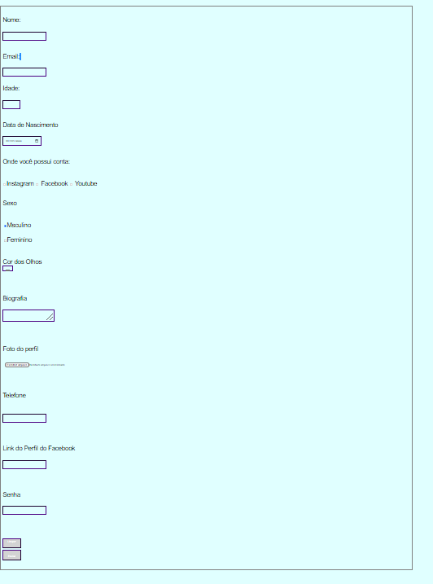

Desafio Do Formulario 

>Esse foi meu segundo projeto de HTML e CSS pela CodeCLUB
### Ajustes e melhorias

O projeto ainda está em desenvolvimento e as próximas atualizações serão voltadas nas seguintes tarefas:

- [x] Estruturar os Formularios 
- [x] Estilizar o projeto
- [ ] Terminar definitivamente

## 🤝 Colaboradores

Agradecemos às seguintes pessoas que contribuíram para este projeto:

<table>
  <tr>
    <td align="center">
      <a href="#">
         
        
          <b>Guilherme Nogueira</b>
        
      </a>
    </td>
    
    
  </tr>
</table>

